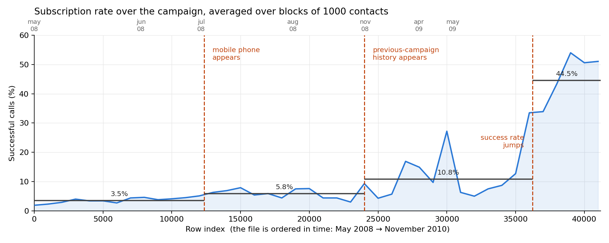

# Bank telemarketing under temporal validation

In this repo we train ML models to predict the outcome of telemarketing calls by a Portuguese
bank, selling subscriptions to long-term deposits. The dataset is `bank-additional-full.csv`
(UCI, 41.188 contacts, May 2008 – November 2010), a popular one in ML tutorials and portfolio
projects.

Almost all of those projects validate on a **random** split. But the file is ordered in time,
and its statistics move underneath the model: the subscription rate goes from 3% over the first
months to 45% over the last ones. **This repo asks what is left of the usual results when the
folds are drawn in time order instead.**



## Headline

Same rows, same model, same features, `duration` excluded: only the fold generator changes.

| logistic regression, client features | ROC-AUC |
|---|---|
| random 10-fold (§4.3) | **0.6682** |
| temporal 10-fold (§4.1) | **0.5433** |

The split is worth **+0.125 ROC-AUC**. Nothing about the model changed.

## The specific question

`bank-additional-names.txt`, shipped with the data, claims that the five macro socio-economic
features (`emp.var.rate`, `cons.price.idx`, `cons.conf.idx`, `euribor3m`, `nr.employed`) "lead
to substantial improvement in the prediction of a success, even when the duration of the call
is not included". Does that hold under temporal validation?

| adding the 5 macro features is worth (ROC-AUC) | random folds | temporal folds |
|---|---|---|
| logistic | +0.0046 | −0.0119 |
| forest | +0.0122 | −0.0185 |
| boosting | +0.0102 | +0.0055 |

With random folds all six comparisons (three models × `duration` in/out) come out positive,
but small: +0.003 to +0.012. With temporal folds four of the six turn negative. On the held-out
test set the difference is +0.0014, smaller than the gap between two model families.

**Why.** The macro features are functions of calendar time, and calendar time is the row index.
Under a shuffled split the fold that predicts a row was also trained on its neighbours, so
these columns hand the model the local base rate. Under a temporal split the model has to
extrapolate that clock past the end of its training data, and the fitted coefficients no longer
apply.

## Results

| protocol | rows | base rate | with macro | client only |
|---|---|---|---|---|
| §4.1 temporal 10-fold, one fit | first 80% | 0.068 | 0.5314 | 0.5433 |
| §4.2 temporal, rolling window | first 80% | 0.070 | 0.5651 | **0.5799** |
| §4.3 random 10-fold | first 80% | 0.064 | 0.6728 | 0.6682 |
| §4.4 rolling window, **test set** | last 20% | 0.308 | 0.7647 | 0.7633 |

*(ROC-AUC, logistic regression, `duration` excluded throughout.)*

**Retraining is the only change that improved a deployable model.** Refitting every 50 contacts
on the previous 5000 rows gives +0.0366 ROC-AUC over a single fit on the same rows, and moves
AP/baseline from 1.29 to 1.60.

**On the test set** (8238 contacts, base rate 30.8%) the delivered logistic regression reaches
ROC-AUC 0.765 and lift 2.33 in the top decile: calling the best-scored 10% of clients finds 2.3
times as many subscribers as calling 10% at random. Adding `duration` would give 0.843, +0.079
— and is the reason published numbers on this dataset look as good as they do. It is the length
of the call, so it does not exist when the decision to call is taken, and it is reported as a
benchmark only.

> The four protocols score different rows and are **not** comparable with each other. The test
> set is the late, high-success regime; §4.1–4.3 are the early one. A single number for "the
> performance of the model" does not exist on this dataset.

## Not a replication

> S. Moro, P. Cortez, P. Rita, *A data-driven approach to predict the success of bank
> telemarketing*, Decision Support Systems **62** (2014) 22–31,
> [doi:10.1016/j.dss.2014.03.001](https://doi.org/10.1016/j.dss.2014.03.001)

This file is a public subset: 41.188 of their 52.944 contacts, ending November 2010 instead of
June 2013, and containing only a handful of the 22 features their selection procedure kept.
Everything about the interest rate offered, the agent, the call context and the bank's internal
client profiling is absent. Their reported ALIFT is also a different quantity from the
`AP/baseline` column used here — see §5 of the notebook.

## Running it

```bash
pip install -r requirements.txt
jupyter notebook Bank_Marketing_Project.ipynb
```

The dataset is included in the repo, so the notebook runs top to bottom as is. §4.2 and §4.3
are the slow cells (a few minutes each).

## Data and licence

The code in this repo is MIT (see `LICENSE`). The dataset is **not** mine: it is the UCI Bank
Marketing dataset, created by S. Moro, P. Cortez and P. Rita, distributed by the
[UCI Machine Learning Repository](https://archive.ics.uci.edu/dataset/222/bank+marketing) under
a **Creative Commons Attribution 4.0 International (CC BY 4.0)** licence, and redistributed
here under those terms. If you use it, cite the paper above, as `bank-additional-names.txt`
asks.
